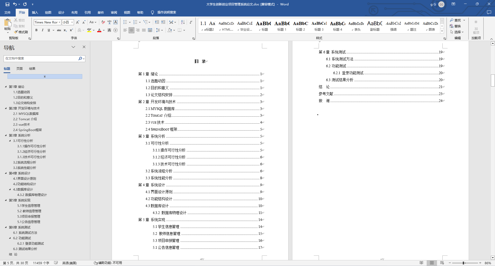

基于SpringBoot的大学生创新创业项目管理系统（程序+论文）
=
- 完整代码获取地址：从戎源码网 ([https://armycodes.com/](https://armycodes.com/))
- 作者微信：19941326836  QQ：952045282 
- 承接计算机毕业设计、Java毕业设计、Python毕业设计、深度学习、机器学习
- 选题+开题报告+任务书+程序定制+安装调试+论文+答辩ppt 一条龙服务
- 所有选题地址https://github.com/nature924/allProject

一、项目介绍
---
基于Spring Boot框架实现的大学生创新创业项目管理系统，系统包含三种角色：管理员、指导教师、用户,系统分为前台和后台两大模块，主要功能如下。

### 管理员：
- 个人中心：管理个人信息和账户。
- 管理员管理：管理系统中的管理员信息。
- 指导教师管理：管理系统中的指导教师信息。
- 学生管理：管理系统中的学生信息。
- 项目申报管理：查看和管理所有的创新创业项目申报信息。
- 选题审核管理：对创新创业项目选题进行审核和审批。
- 项目进度管理：查看和管理所有创新创业项目的进展情况。
- 基础数据管理：管理系统中的基础数据信息。
- 公告信息管理：发布和管理系统中的公告信息。
- 系统管理：修改个人密码和其他系统设置。

### 指导老师：
- 个人中心：管理个人信息和账户。
- 学生管理：管理所指导的学生信息。
- 项目申报管理：查看和管理所指导的创新创业项目申报信息。
- 选题审核管理：对所指导的创新创业项目选题进行审核和审批。
- 项目进度管理：查看和管理所指导的创新创业项目的进展情况。
- 公告信息管理：查看系统发布的公告信息。
- 系统管理：修改个人密码和其他系统设置。

### 学生：
- 个人中心：管理个人信息和账户。
- 项目申报管理：提交创新创业项目的申报。
- 选题审核管理：查看和管理创新创业项目选题审核情况。
- 项目进度管理：查看和管理参与的创新创业项目的进展情况。
- 公告信息管理：查看系统发布的公告信息。
- 系统管理：修改个人密码和其他系统设置。

二、项目技术
---
- 编程语言：Java
- 数据库：MySQL
- 项目管理工具：Maven
- 前端技术：VUE、HTML、Jquery、Bootstrap
- 后端技术：Spring、SpringMVC、MyBatis

三、运行环境
---
- 操作系统：Windows、macOS都可以
- JDK版本：JDK1.8以上都可以
- 开发工具：IDEA、Ecplise、Myecplise都可以
- 数据库: MySQL5.7以上都可以
- Tomcat：任意版本都可以
- Maven：任意版本都可以

四、运行截图
---
### 论文截图：

### 程序截图：

